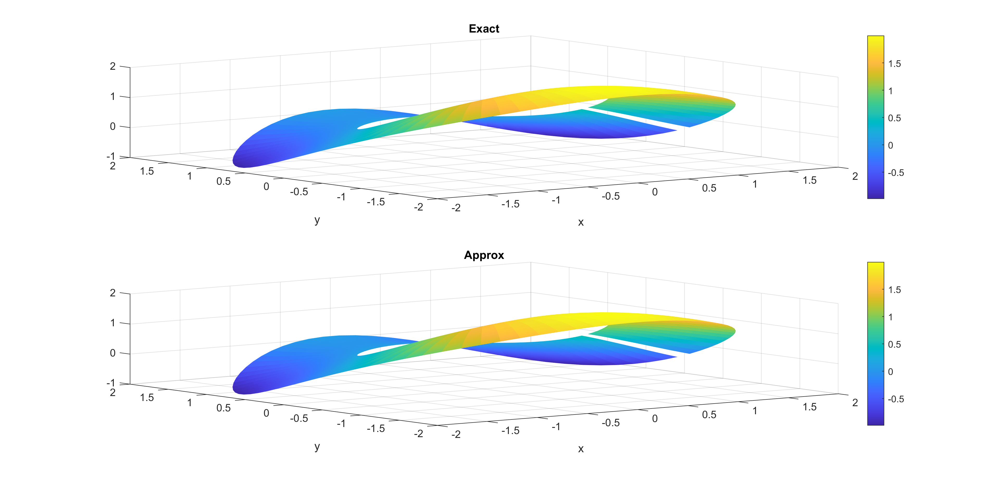

MOLE: Mimetic Operators Library Enhanced
========================================

1: Description
--------------

MOLE is a high quality (C++ & MATLAB) library that implements 
high-order mimetic operators to solve partial differential equations. 
It provides discrete analogs of the most common vector calculus operators: 
Gradient, Divergence, Laplacian and Curl. These operators (matrices) act 
on staggered grids (uniform and nonuniform) and they satisfy local and 
global conservation laws.

The mathematics is based on the work of [Corbino and Castillo, 2020]. 
However the user may find useful previous publications such as [Castillo and Grone, 2003],
in which similar operators are derived using a matrix analysis approach.

2: Licensing
------------

MOLE is distributed under a dual-licensing model, please refer to the 
LICENSE.txt and GPLv3.txt files for more information on this.

3: Installation
---------------

In order to install MOLE (C++ version), you need to have Armadillo C++ 
Linear Algebra Library. You can easily download Armadillo from: 
<http://arma.sourceforge.net/download.html>, or simply install it via:

`sudo apt install libarmadillo-dev`

We suggest to use the latest stable version that is available. Also, 
we recommend to use the `qmake` tool to generate the `Makefile` of the project.

**NOTE**: If you installed Armadillo via its sourcefiles (`.tar.xz`), then you 
must set the `ARMA` variable in `mole.pro` with the location of Armadillo in 
your computer. e.g. `ARMA = /home/johnny/armadillo-7.950.1`

Then open a terminal and execute the following commands,

`qmake`

`make`

a static library named `libmole.a` will be created.
If you do not have `qmake` installed, you can simply modify the original 
`Makefile` provided. From this point you just need to include `mole.h` 
in your projects and specify the location of `libmole.a` to the linker.

For the MATLAB version of our library, the only dependency is to have MATLAB installed.
The two implementations of MOLE (C++ & MATLAB) are independent, that is, you don't need
to build the C++ version if you are just interested in using MOLE from MATLAB.

4: Citations
------------

Please cite our work if you use MOLE in your research and/or software. 
Citations are useful for the continued development and maintenance of 
the library https://www.sciencedirect.com/science/article/abs/pii/S0377042719303231

